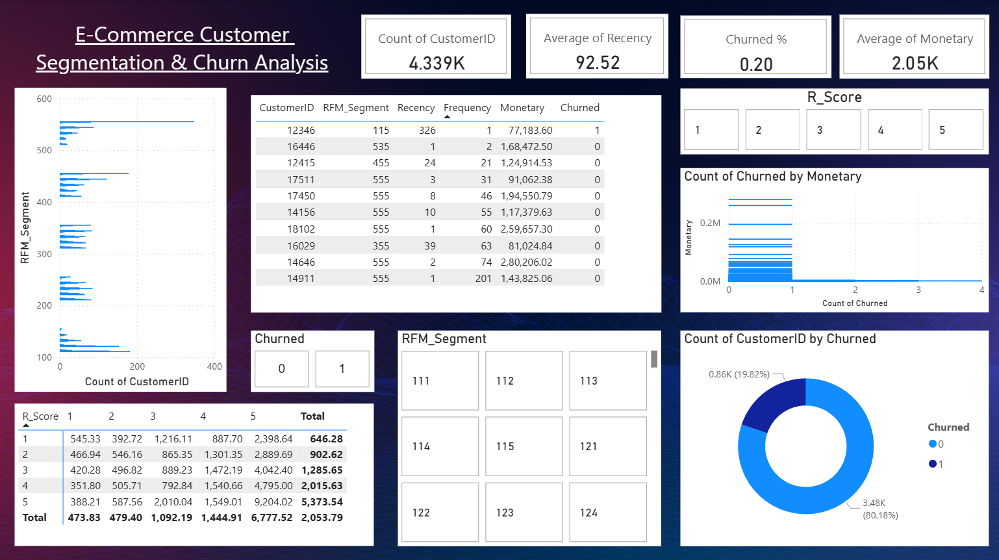

# 🛍️ E-Commerce Customer Segmentation & Churn Analysis

This project performs **RFM segmentation** and **churn analysis** on e-commerce customer data using **Python** and **Power BI**, helping derive actionable insights for marketing strategies.

---

## 📊 Dashboard Overview

- **Customer Segments** by RFM scores  
- **Churn Insights** (retained vs lost customers)  
- **Top Value Customers** filter  
- **Heatmap** of R-F segments with average spending  

> Built in: Power BI  
> Data processed with: Python (pandas, sklearn)  

---

## 🧠 Techniques Used

- RFM Segmentation (Recency, Frequency, Monetary)
- Churn Labeling (`Churned` column from Recency)
- Grouping + scoring using quantiles
- Visualization in Power BI

---

## 📁 Project Structure

```
📦 
├── README.md
├── data
  ├── Online Retail.xlsx
  ├── data.csv
├── images
  ├── dashboard_preview.png
├── notebook
  ├── rfm_churn.csv
  ├── rfm_churn_analysis.ipynb
├── powerbi
  ├── RFM_Churn_Report.pbix.pbix
```
©generated by [GitTree](https://github.com/sachinz25/GitTree)

yaml
Copy code

---

## 🧪 Sample Visuals



---

## 🚀 How to Run

1. Clone the repo  
2. Open `notebooks/rfm_churn_analysis.ipynb` to see Python part  
3. Open `powerbi/RFM_Churn_Report.pbix` in Power BI Desktop  
4. Use filters to explore insights

---
